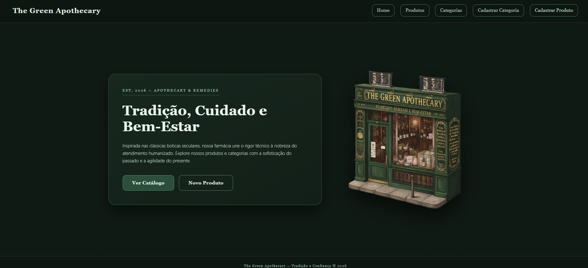

# The Green Apothecary

> A web application with a vintage aesthetic inspired by traditional apothecary shops, built using React, TypeScript, and Vite.

## 📸 Application Preview


## 📋 About the Project
**The Green Apothecary** is a complete pharmacy management system featuring full CRUD operations for Categories and Products, dynamic routing, styled navigation, and a customized classic green vintage visual identity.

---

*(Below are the original setup instructions from the project template)*

# React + TypeScript + Vite

This template provides a minimal setup to get React working in Vite with HMR and some Oxlint rules.

Currently, two official plugins are available:

- [@vitejs/plugin-react](https://github.com/vitejs/plugin-react/blob/main/packages/plugin-react) uses [Oxc](https://oxc.rs)
- [@vitejs/plugin-react-swc](https://github.com/vitejs/plugin-react-swc) uses [SWC](https://swc.rs/)

## React Compiler

The React Compiler is not enabled on this template because of its impact on dev & build performances. To add it, see [this documentation](https://react.dev/learn/react-compiler/installation).

## Expanding the Oxlint configuration

If you are developing a production application, we recommend enabling type-aware lint rules by installing `oxlint-tsgolint` and editing `.oxlintrc.json`:

```json
{
  "$schema": "./node_modules/oxlint/configuration_schema.json",
  "plugins": ["react", "typescript", "oxc"],
  "options": {
    "typeAware": true
  },
  "rules": {
    "react/rules-of-hooks": "error",
    "react/only-export-components": ["warn", { "allowConstantExport": true }]
  }
}
